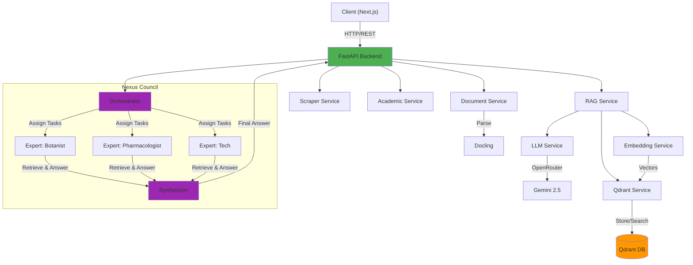

# 🚀 Nexus AI: Enterprise Knowledge Assistant

A production-ready **Retrieval Augmented Generation (RAG)** system combining vector search with a state-of-the-art knowledge graph for enhanced information retrieval and question answering.

[](https://www.python.org/downloads/)
[](https://fastapi.tiangolo.com/)
[](LICENSE)
[](https://nextjs.org/)

---

## ✨ Features

### 🏛️ Nexus Council (Multi-Agent RAG)
- **🤖 Specialized Agents**: Consult a panel of experts (Botanist, Pharmacologist, Production Specialist, Data Analyst).
- **🎼 Intelligent Orchestration**: Automatically breaks down complex queries and assigns sub-tasks to relevant experts.
- **🧠 Synthesis Engine**: Combines insights from multiple experts into a comprehensive, cohesive answer.
- **🇩🇪 German Localization**: Fully localized user interface ("Rat Aktiv", "Ratsberichte").

### 🎯 Core Capabilities
- **🌍 Multilingual Support**: Query in any language (50+ languages supported), UI in German.
- **📊 Hybrid Retrieval**: Vector search + Knowledge Graph for superior accuracy.
- **📚 Multi-Collection Knowledge**: Targeted retrieval from specific domains (Botanical, Pharmacological, etc.).
- **🔄 Smart Deduplication**: Automatic content deduplication using deterministic IDs.
- **📄 Multi-Format Support**: PDF, DOCX, PPTX, HTML, Images via [Docling](https://github.com/DS4SD/docling).
- **🌐 Web Scraping**: Recursive URL crawling with intelligent content extraction.
- **🎓 Academic Scraper**: Integrated search for scientific papers via Semantic Scholar & Crossref (with PDF auto-download).
- **🎓 Academic Scraper**: Integrated search for scientific papers via Semantic Scholar & Crossref (with PDF auto-download).
- **🧪 Structured Data Ingestion**: Dedicated XML parser for chemical compound databases.

### 🌿 Nexus Grow Vision
- **👁️ Plant Diagnosis**: Upload photos of cannabis leaves for instant AI analysis.
- **⚕️ Multimodal Rag**: Combines Gemini Vision (image analysis) with the Botanical Agent (RAG) for accurate treatment advice.
- **🕸️ Visual Knowledge**: Shows interactive Knowledge Graph connections for diagnosed deficiencies.

### 🛡️ Security & Reliability
- **🔐 API Key Authentication**: Secure endpoint access.
- **⏱️ Rate Limiting**: Configurable per-endpoint limits.
- **🔁 Automatic Retries**: Exponential backoff for LLM API calls.
- **📝 Comprehensive Logging**: Detailed request/response tracking.

### 🧠 AI-Powered
- **Embedding Model**: `paraphrase-multilingual-MiniLM-L12-v2` (384-dim).
- **LLM**: Google Gemini 2.5 Flash Lite (via OpenRouter).
- **Vector Database**: Qdrant for high-performance similarity search.
- **Knowledge Graph**: Entity resolution with semantic relationship mapping.

---

## 🏗️ Architecture



---

## 📦 Installation

### Prerequisites
- Python 3.12+
- Node.js 18+ (for Frontend)
- Qdrant (Docker or local)
- OpenRouter API Key

### 1. Clone the Repository
```bash
git clone <repository-url>
cd RAG-backend
```

### 2. Backend Setup
```bash
# Set up virtual environment
python -m venv .venv
source .venv/bin/activate  # Windows: .venv\Scripts\activate

# Install dependencies
pip install -r requirements.txt
```

### 3. Frontend Setup
```bash
cd src/frontend
npm install
```

### 4. Configuration
Create a `.env` file in the project root:

```env
# OpenRouter LLM Settings
OPENROUTER_API_KEY=your_key
LLM_MODEL=google/gemini-2.5-flash-lite-preview

# Qdrant Settings
QDRANT_HOST=localhost
QDRANT_PORT=6333

# Security
BACKEND_API_KEY=your_secure_key
ALLOWED_ORIGINS=http://localhost:3000

# Frontend (in src/frontend/.env.local)
NEXT_PUBLIC_API_URL=http://localhost:8000/api/v1
NEXT_PUBLIC_API_KEY=your_secure_key
```

### 5. Start Services

**Backend:**
```bash
uvicorn src.main:app --reload
```

**Frontend:**
```bash
cd src/frontend
npm run dev
```

The Web UI will be at `http://localhost:3000`.

---

## 🎮 Usage

### Nexus Council Mode
1. Open the Web UI.
2. Select **"Nexus Council"** from the top-left menu.
3. Choose your **Council Members** from the sidebar.
4. Ask a question! The system will orchestrate the experts to answer.

### Ingestion Options
Use the **"Inhalte aufnehmen"** (Ingest Content) page to build your knowledge base:
1.  **File Upload**: Upload PDFs, text files, or images.
2.  **Web Crawl**: Enter a URL to scrape and ingest recursively.
3.  **Academic Search**: Enter a topic (e.g., "Cannabinoids pain") to fetch, download, and digest scientific papers automatically.
4.  **Database Import**: Import structured data (e.g., XML compounds).

> **Note**: Don't forget to select the target **Collection** (e.g., "Botanical Knowledge") to ensure the right expert finds the data!

---

## 🧪 Testing

### Backend Tests
```bash
pytest tests/ -v
```

### Frontend Tests
```bash
cd src/frontend
npm test
```

---

## 📂 Project Structure

```
RAG-backend/
├── src/
│   ├── api/               # API routes
│   ├── core/              # Config, Council Definition
│   ├── services/          # Business Logic
│   │   ├── council_service.py # Council orchestration
│   │   ├── llm_service.py     # LLM & Synthesis
│   │   └── ...
│   ├── frontend/          # Next.js Application
│   │   ├── components/    # ChatInterface, Sidebar, etc.
│   │   └── ...
├── tests/                 # Backend Unit Tests
├── requirements.txt
└── README.md
```

---

## 📝 License

This project is licensed under the MIT License.

---

**Built with ❤️ for advanced information retrieval**
