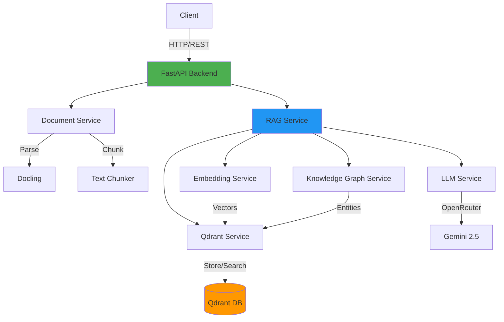

# 🚀 Advanced RAG Backend System

A production-ready **Retrieval Augmented Generation (RAG)** system combining vector search with a state-of-the-art knowledge graph for enhanced information retrieval and question answering.

[](https://www.python.org/downloads/)
[](https://fastapi.tiangolo.com/)
[](LICENSE)

---

## ✨ Features

### 🎯 Core Capabilities
- **🌍 Multilingual Support**: Query in any language (50+ languages supported)
- **📊 Hybrid Retrieval**: Vector search + Knowledge Graph for superior accuracy
- **🔄 Smart Deduplication**: Automatic content deduplication using deterministic IDs
- **📄 Multi-Format Support**: PDF, DOCX, PPTX, HTML, Images via [Docling](https://github.com/DS4SD/docling)
- **🌐 Web Scraping**: Recursive URL crawling with intelligent content extraction
- **⚡ Optimized Performance**: Batched LLM processing (200k chars/request)

### 🛡️ Security & Reliability
- **🔐 API Key Authentication**: Secure endpoint access
- **⏱️ Rate Limiting**: Configurable per-endpoint limits
- **🔁 Automatic Retries**: Exponential backoff for LLM API calls
- **📝 Comprehensive Logging**: Detailed request/response tracking

### 🧠 AI-Powered
- **Embedding Model**: `paraphrase-multilingual-MiniLM-L12-v2` (384-dim)
- **LLM**: Google Gemini 2.5 Flash Lite (via OpenRouter)
- **Vector Database**: Qdrant for high-performance similarity search
- **Knowledge Graph**: Entity resolution with semantic relationship mapping

---

## 🏗️ Architecture



---

## 📦 Installation

### Prerequisites
- Python 3.12+
- Qdrant (Docker or local installation)
- OpenRouter API Key

### 1. Clone the Repository
```bash
git clone <repository-url>
cd RAG-backend
```

### 2. Set Up Virtual Environment
```bash
python -m venv .venv
source .venv/bin/activate  # On Windows: .venv\Scripts\activate
```

### 3. Install Dependencies
```bash
pip install -r requirements.txt
```

### 4. Configure Environment Variables
Create a `.env` file in the project root:

```env
# OpenRouter LLM Settings
OPENROUTER_API_KEY=your_openrouter_api_key_here
LLM_MODEL=google/gemini-2.5-flash-lite-preview

# Qdrant Settings
QDRANT_HOST=localhost
QDRANT_PORT=6333

# Security
BACKEND_API_KEY=your_secure_api_key_here
ALLOWED_ORIGINS=http://localhost:3000,http://localhost:8000
```

### 5. Start Qdrant
```bash
docker run -p 6333:6333 qdrant/qdrant
```

### 6. Run the Backend
```bash
uvicorn src.main:app --reload
```

The API will be available at `http://localhost:8000`

---

## 🎮 Usage

### Web Interface
Navigate to `http://localhost:8000` to access the built-in frontend.

### API Documentation
Interactive API docs available at:
- **Swagger UI**: `http://localhost:8000/docs`
- **ReDoc**: `http://localhost:8000/redoc`

### Example: Ingest a Document
```bash
curl -X POST "http://localhost:8000/api/v1/ingest/file" \
  -H "X-API-Key: your_api_key" \
  -F "file=@document.pdf"
```

### Example: Query the System
```bash
curl -X POST "http://localhost:8000/api/v1/query" \
  -H "X-API-Key: your_api_key" \
  -H "Content-Type: application/json" \
  -d '{
    "query": "What are terpenes?",
    "limit": 5
  }'
```

### Example: Ingest from URL
```bash
curl -X POST "http://localhost:8000/api/v1/ingest/url" \
  -H "X-API-Key: your_api_key" \
  -H "Content-Type: application/json" \
  -d '{
    "url": "https://example.com/article",
    "recursive": true
  }'
```

---

## 📂 Project Structure

```
RAG-backend/
├── src/
│   ├── api/
│   │   └── routes.py          # API endpoints
│   ├── core/
│   │   ├── config.py          # Configuration management
│   │   └── limiter.py         # Rate limiting
│   ├── models/
│   │   └── schemas.py         # Pydantic models
│   ├── services/
│   │   ├── document_service.py    # Document parsing & chunking
│   │   ├── embedding_service.py   # Text embeddings
│   │   ├── kg_service.py          # Knowledge graph
│   │   ├── llm_service.py         # LLM interactions
│   │   ├── qdrant_service.py      # Vector database
│   │   ├── rag_service.py         # RAG orchestration
│   │   └── scraper_service.py     # Web scraping
│   └── main.py                # Application entry point
├── src/frontend/              # Next.js frontend
├── tests/                     # Unit & integration tests
├── requirements.txt           # Python dependencies
└── README.md                  # This file
```

---

## 🔧 Configuration

### Key Settings (`src/core/config.py`)

| Setting | Default | Description |
|---------|---------|-------------|
| `EMBEDDING_MODEL_NAME` | `paraphrase-multilingual-MiniLM-L12-v2` | Multilingual embedding model |
| `LLM_MODEL` | `google/gemini-2.5-flash-lite-preview` | LLM for entity extraction & QA |
| `QDRANT_HOST` | `localhost` | Qdrant server host |
| `QDRANT_PORT` | `6333` | Qdrant server port |

### Rate Limits

| Endpoint | Limit |
|----------|-------|
| `/query` | 100/minute |
| `/ingest` | 50/minute |
| `/ingest/file` | 20/minute |
| `/ingest/url` | 10/minute |

---

## 🧪 Testing

Run the test suite:
```bash
pytest tests/ -v
```

Run with coverage:
```bash
pytest tests/ --cov=src --cov-report=html
```

---

## 🚀 Advanced Features

### Knowledge Graph Construction
The system automatically extracts entities and relationships from ingested content:
- **Entity Resolution**: Semantic deduplication of entities
- **Relationship Mapping**: Automatic relation extraction
- **Graph-Enhanced Retrieval**: Combines vector similarity with graph traversal

### Multilingual Capabilities
- **Cross-lingual Search**: Query in German, retrieve English documents (and vice versa)
- **Language-Adaptive Responses**: Answers automatically match the query language
- **50+ Languages**: Supports all major languages via multilingual embeddings

### Optimized LLM Usage
- **Batched Processing**: Processes up to 200k characters per LLM call
- **Smart Chunking**: Small chunks for retrieval, large blocks for entity extraction
- **Retry Logic**: Automatic retry with exponential backoff for API failures

---

## 📊 Performance

- **Embedding Speed**: ~1000 docs/sec (CPU)
- **Vector Search**: <50ms for 1M vectors
- **End-to-End Query**: ~2-5 seconds (including LLM)
- **Concurrent Users**: 100+ (with proper scaling)

---

## 🛠️ Development

### Adding a New Endpoint
1. Define the route in `src/api/routes.py`
2. Create request/response models in `src/models/schemas.py`
3. Implement business logic in appropriate service
4. Add tests in `tests/`

### Extending the Knowledge Graph
Modify `src/services/kg_service.py` to add custom entity types or relationship logic.

---

## 🐛 Troubleshooting

### Common Issues

**Q: "ModuleNotFoundError" when starting**  
A: Ensure you're in the virtual environment and all dependencies are installed:
```bash
source .venv/bin/activate
pip install -r requirements.txt
```

**Q: Qdrant connection errors**  
A: Verify Qdrant is running:
```bash
docker ps | grep qdrant
```

**Q: LLM API errors (429 Too Many Requests)**  
A: The system will automatically retry. Check your OpenRouter rate limits.

**Q: Duplicate results in search**  
A: Re-ingest your documents. The deduplication only applies to new ingestions.

---

## 📝 License

This project is licensed under the MIT License - see the [LICENSE](LICENSE) file for details.

---

## 🤝 Contributing

Contributions are welcome! Please:
1. Fork the repository
2. Create a feature branch (`git checkout -b feature/amazing-feature`)
3. Commit your changes (`git commit -m 'Add amazing feature'`)
4. Push to the branch (`git push origin feature/amazing-feature`)
5. Open a Pull Request

---

## 📧 Contact

For questions or support, please open an issue on GitHub.

---

## 🙏 Acknowledgments

- [FastAPI](https://fastapi.tiangolo.com/) - Modern web framework
- [Qdrant](https://qdrant.tech/) - Vector database
- [Docling](https://github.com/DS4SD/docling) - Document parsing
- [FastEmbed](https://github.com/qdrant/fastembed) - Fast embeddings
- [OpenRouter](https://openrouter.ai/) - LLM API gateway

---

**Built with ❤️ for advanced information retrieval**
